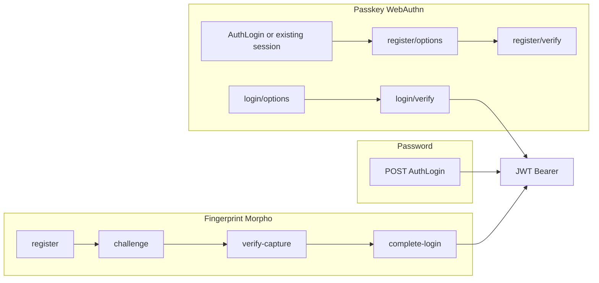

# Complete authentication API flows (Sparkle RFID)

This document describes **all** login and registration-related APIs, **in what order** to call them, **sample payloads**, **responses**, and **when each API is used**.

**Base URL (example):** `https://your-api-host`  

**JSON naming (this project):** Controllers use `PropertyNamingPolicy = null`, so **request bodies** use **PascalCase** for model properties (`LoginName`, `ClientCode`, `Pin`, …). **Responses differ by endpoint:**  
- `POST /api/ProductMaster/AuthLogin` returns **PascalCase** (`Token`, `IsSubUser`, `RoleType`, …).  
- Fingerprint and passkey endpoints return **camelCase** in anonymous payloads (`success`, `message`, `token`, `isSubUser`, …).  
Frontends should read the field names exactly as each endpoint returns them.

---

## 1. How the pieces fit together

| Method | Purpose | Needs JWT? |
|--------|---------|------------|
| Password login | Universal fallback, first-time access | No |
| Fingerprint (Morpho) | RD device capture + PIN second factor | Register/login APIs: **No** (validated by LoginName + ClientCode + server rules) |
| Passkey (WebAuthn) | Browser/device cryptographic login | Register + list + remove: **Yes**. Login: **No** |

All successful logins issue the **same style JWT** (`JwtService`) so existing protected APIs work unchanged.



---

## 2. Flow A — Classic password login (unchanged)

### Use case

- Default login for every user.
- Required when passkey/fingerprint is not set up, failed, or user prefers password.
- **Passkey registration** step in the UI should start **after** this login (user must be authenticated for `/api/auth/passkey/register/*`).

### API

| Step | Method | Path | Auth |
|------|--------|------|------|
| 1 | `POST` | `/api/ProductMaster/AuthLogin` | None |

### Request body

```json
{
  "LoginName": "monty",
  "Password": "YourStrongPassword"
}
```

### Success response (shape)

**Super admin / non–sub-user (PascalCase):**

```json
{
  "Token": "<jwt>",
  "IsSubUser": false,
  "RoleType": "SuperAdmin",
  "Permissions": {},
  "AllowedBranchIds": null,
  "HasAllBranchAccess": true
}
```

**RFID dashboard sub-user:** same keys; `IsSubUser` is `true`, `Permissions` and `AllowedBranchIds` reflect branch/role rules.

### After this call

- Store `Token` as `Authorization: Bearer <Token>` for all **JWT-protected** endpoints (passkey register, passkey list/remove, RFID APIs, etc.).

---

## 3. Flow B — Fingerprint **registration** (Morpho RD + PIN)

### Use case

- User will log in later using **fingerprint capture + PIN** (not password).
- Recommended UX: perform this **only after** the user has signed in with password (so only the real user enrolls).  
  **Note:** The backend `POST /api/auth/fingerprint/register` does **not** require JWT; it validates `LoginName` + `ClientCode` + PID XML. Locking enrollment to “logged-in only” is a **frontend/route guard** concern unless you add `[Authorize]` on that action later.

### Sequence (order of calls)

1. User authenticated in UI (recommended) OR client collects `LoginName` / `ClientCode` securely.
2. Local Morpho / RD service captures fingerprint → produces **`PidXml`** and optionally **`DeviceInfoXml`**.
3. **`POST /api/auth/fingerprint/register`** — enroll device + PIN hash + enable fingerprint for user.

### B1 — Register capture + PIN

| Field | Value |
|-------|--------|
| Method | `POST` |
| Path | `/api/auth/fingerprint/register` |
| Auth | None (body identifies user) |

**Request**

```json
{
  "LoginName": "monty",
  "ClientCode": "LS000410",
  "DeviceName": "Morpho USB",
  "FriendlyDeviceName": "Counter PC Reader",
  "PidXml": "<PidData>...</PidData>",
  "DeviceInfoXml": "<DeviceInfo ... />",
  "BranchId": 1,
  "EmployeeId": 101,
  "Pin": "4589"
}
```

**Success response (example)**

```json
{
  "success": true,
  "message": "Fingerprint capture registered successfully.",
  "data": {
    "loginName": "monty",
    "isEnabled": true,
    "deviceSerialNumber": "2536I005530",
    "qualityScore": 67,
    "nmPoints": 27
  }
}
```

**Use case of this API:** Persist “fingerprint mode enabled”, device serial allow-list data, and **hashed PIN** for later `complete-login`. It does **not** issue JWT.

**Next step for the user:** normal logout/login testing using **Flow C** (fingerprint login).

---

## 4. Flow C — Fingerprint **login** (Morpho + PIN)

### Use case

- User has completed registration (Flow B) and has a PIN set.
- Each login: challenge → scan → verify capture → enter PIN → JWT.

### Sequence

| Step | API | Purpose |
|------|-----|---------|
| 1 | `POST .../challenge` | One-time server challenge (anti-replay). |
| 2 | *(client)* | Morpho captures finger → `PidXml` (+ `DeviceInfoXml`). |
| 3 | `POST .../verify-capture` | Validates challenge + capture; returns `transactionId` (not JWT). |
| 4 | *(user)* | Enter PIN. |
| 5 | `POST .../complete-login` | Validates PIN + transaction → **JWT**. |

### C1 — Create challenge

| Field | Value |
|-------|--------|
| Method | `POST` |
| Path | `/api/auth/fingerprint/challenge` |
| Auth | None |

**Request**

```json
{
  "LoginName": "monty",
  "ClientCode": "LS000410"
}
```

**Success response**

```json
{
  "success": true,
  "data": {
    "challengeId": "chlg_abc123...",
    "expiresInSeconds": 60
  }
}
```

**Use case:** Bind the next capture to a short-lived, single-use challenge.

**Next:** call Morpho, then **C2**.

---

### C2 — Verify capture (still no JWT)

| Field | Value |
|-------|--------|
| Method | `POST` |
| Path | `/api/auth/fingerprint/verify-capture` |
| Auth | None |

**Request**

```json
{
  "LoginName": "monty",
  "ClientCode": "LS000410",
  "ChallengeId": "chlg_abc123...",
  "PidXml": "<PidData>...</PidData>",
  "DeviceInfoXml": "<DeviceInfo ... />"
}
```

**Success response**

```json
{
  "success": true,
  "message": "Fingerprint capture accepted. Continue with OTP/PIN.",
  "data": {
    "requiresSecondFactor": true,
    "transactionId": "txn_xyz789..."
  }
}
```

**Use case:** Prove a fresh capture succeeded and device is allowed; open PIN screen. **Does not** issue JWT.

**Next:** **C3** with `transactionId` + PIN.

---

### C3 — Complete login (JWT issued)

| Field | Value |
|-------|--------|
| Method | `POST` |
| Path | `/api/auth/fingerprint/complete-login` |
| Auth | None |

**Request**

```json
{
  "LoginName": "monty",
  "TransactionId": "txn_xyz789...",
  "Pin": "4589"
}
```

(`Otp` is reserved; wire your SMS/email OTP later if needed.)

**Success response** — same information as password login, but **camelCase** keys and wrapped with `success` / `message`:

```json
{
  "success": true,
  "message": "Login successful.",
  "token": "<jwt>",
  "isSubUser": false,
  "roleType": "SuperAdmin",
  "permissions": {},
  "allowedBranchIds": null,
  "hasAllBranchAccess": true
}
```

**Use case:** Final step; issues **JWT** for the SPA. Use the `token` value like `AuthLogin`’s `Token`.

---

## 5. Fingerprint **management** APIs

### D1 — Get status

| Field | Value |
|-------|--------|
| Method | `GET` |
| Path | `/api/auth/fingerprint/status?LoginName=monty&ClientCode=LS000410` |
| Auth | None |

**Use case:** Settings screen — show whether fingerprint is enabled, PIN present, registered devices.

**Example success**

```json
{
  "success": true,
  "data": {
    "loginName": "monty",
    "clientCode": "LS000410",
    "isEnabled": true,
    "preferredSecondFactor": "PIN",
    "hasPin": true,
    "devices": [
      {
        "deviceSerialNumber": "2536I005530",
        "friendlyDeviceName": "Counter PC Reader",
        "deviceType": "...",
        "isAllowed": true,
        "lastUpdated": "2026-04-02T10:00:00Z"
      }
    ]
  }
}
```

---

### D2 — Enable / disable fingerprint mode

| Field | Value |
|-------|--------|
| Method | `POST` |
| Path | `/api/auth/fingerprint/set-status` |
| Auth | None |

**Request**

```json
{
  "LoginName": "monty",
  "ClientCode": "LS000410",
  "IsEnabled": false
}
```

**Use case:** Toggle fingerprint login without deleting DB rows (depending on your product rules).

---

## 6. Flow D — Passkey **registration** (WebAuthn)

### Prerequisites

- User must have a **valid JWT** (typically from **Flow A**).
- Configure **`Fido2`** in `appsettings.json`: `ServerDomain` (RP ID), `ServerName`, `Origins` must match your SPA’s origin(s).

### Sequence

| Step | API | Purpose |
|------|-----|---------|
| 1 | `POST /api/auth/passkey/register/options` | Server creates WebAuthn “create” options + `sessionId`. |
| 2 | *(browser)* | `navigator.credentials.create({ publicKey: options })` |
| 3 | `POST /api/auth/passkey/register/verify` | Server verifies attestation, stores public key in `tblUserPasskey`. |

### D1 — Register options

| Field | Value |
|-------|--------|
| Method | `POST` |
| Path | `/api/auth/passkey/register/options` |
| Auth | **Bearer JWT** |

**Request** (optional friendly label for UI only; can be empty object)

```json
{
  "FriendlyName": "My laptop"
}
```

**Success response**

```json
{
  "success": true,
  "sessionId": "a1b2c3d4e5f6...",
  "options": { }
}
```

(`sessionId` is lowercase in JSON.) The `options` object is Fido2 **`CredentialCreateOptions`** — pass it to `navigator.credentials.create` (your WebAuthn helper maps it to `publicKey` if needed).

**Use case:** Start passkey enrollment for the **currently logged-in** user.

**Next:** WebAuthn `create`, then **D2**.

---

### D2 — Register verify

| Field | Value |
|-------|--------|
| Method | `POST` |
| Path | `/api/auth/passkey/register/verify` |
| Auth | **Bearer JWT** (same user as step D1) |

**Request**

```json
{
  "SessionId": "a1b2c3d4e5f6...",
  "FriendlyName": "My laptop",
  "AttestationResponse": { }
}
```

`AttestationResponse` must match **`AuthenticatorAttestationRawResponse`** (Fido2 / WebAuthn client output: `id`, `rawId`, `type`, `response`, etc.).

**Success response (example)**

```json
{
  "success": true,
  "message": "Passkey registered.",
  "credentialIdBase64Url": "..."
}
```

(`credentialIdBase64Url` is lowercase in JSON.)

**Use case:** Finish enrollment; credential stored for future passwordless login.

---

## 7. Flow E — Passkey **login** (passwordless)

### Sequence

| Step | API | Purpose |
|------|-----|---------|
| 1 | `POST /api/auth/passkey/login/options` | Load allowed credentials + assertion options + `sessionId`. |
| 2 | *(browser)* | `navigator.credentials.get({ publicKey: options })` |
| 3 | `POST /api/auth/passkey/login/verify` | Verify assertion → **JWT**. |

### E1 — Login options

| Field | Value |
|-------|--------|
| Method | `POST` |
| Path | `/api/auth/passkey/login/options` |
| Auth | None |

**Request**

```json
{
  "LoginName": "monty",
  "ClientCode": "LS000410"
}
```

**Success response**

```json
{
  "success": true,
  "sessionId": "f6e5d4c3b2a1...",
  "options": { }
}
```

`options` is Fido2 **`AssertionOptions`** for `navigator.credentials.get`.

**Use case:** User chose “Sign in with passkey” and entered username + client. **Fails** if user has no passkeys registered.

**Next:** WebAuthn `get`, then **E2**.

---

### E2 — Login verify

| Field | Value |
|-------|--------|
| Method | `POST` |
| Path | `/api/auth/passkey/login/verify` |
| Auth | None |

**Request**

```json
{
  "SessionId": "f6e5d4c3b2a1...",
  "AssertionResponse": { }
}
```

`AssertionResponse` must match **`AuthenticatorAssertionRawResponse`** from the browser.

**Success response** — same claims as other logins, **camelCase** (`token`, not `Token`):

```json
{
  "success": true,
  "message": "Login successful.",
  "token": "<jwt>",
  "isSubUser": false,
  "roleType": "SuperAdmin",
  "permissions": {},
  "allowedBranchIds": null,
  "hasAllBranchAccess": true
}
```

**Use case:** Passwordless login completed.

---

## 8. Passkey **management** APIs (JWT required)

### F1 — List passkeys

| Field | Value |
|-------|--------|
| Method | `GET` |
| Path | `/api/auth/passkey/list` |
| Auth | **Bearer JWT** |

**Example success**

```json
{
  "success": true,
  "passkeys": [
    {
      "Id": 3,
      "FriendlyName": "My laptop",
      "AaGuid": "...",
      "Transports": "UsbInternal",
      "CreatedOn": "2026-04-01T12:00:00Z",
      "LastUsedOn": null,
      "credentialIdBase64Url": "..."
    }
  ]
}
```

**Use case:** Security settings — show registered passkeys; use `Id` for **remove**.

---

### F2 — Remove passkey

| Field | Value |
|-------|--------|
| Method | `POST` |
| Path | `/api/auth/passkey/remove` |
| Auth | **Bearer JWT** |

**Request**

```json
{
  "PasskeyId": 3
}
```

(`PasskeyId` is the primary key from `tblUserPasskey` / list API.)

**Use case:** Revoke one passkey (soft-deleted in DB).

---

## 9. Configuration checklist (Passkey / WebAuthn)

- **`Fido2:ServerDomain`**: Relying Party ID — usually your site hostname **without** port (e.g. `sparkleerp.loyalstring.in`). Must match how browsers resolve the origin.
- **`Fido2:Origins`**: Exact SPA origins: `https://sparkleerp.loyalstring.in`, `http://localhost:3000`, etc.
- **HTTPS** in production for WebAuthn.

---

## 10. Database scripts (reference)

- Fingerprint-related tables: see your fingerprint SQL / EF migrations.
- Passkey tables: `Scripts/passkey_and_webauthn_ceremony_tables.sql` (`tblUserPasskey`, `tblWebAuthnCeremony`).

---

## 11. Quick “which flow should I use?”

| User situation | Flow |
|----------------|------|
| Normal login, any device | **A** — `AuthLogin` |
| Branch PC with Morpho + PIN | **C** — fingerprint challenge → verify-capture → complete-login |
| First-time Morpho setup | **B** — register |
| Browser passwordless (recommended long-term) | **E** after **D** registration |
| Manage WebAuthn keys | **F1 / F2** with JWT |

---

## 12. Relationship between “old” and “new” APIs

- **Same user account** (`ApplicationUser`: `LoginName`, `ClientCode`, `Id`).
- **Same JWT** after any successful login path.
- **No automatic merge** of Morpho PID and passkey — they are different credential stores; the user may have **password + fingerprint + passkeys** enabled at the same time unless you restrict that in the UI.

---

*Generated for Sparkle RFID backend. Adjust hostnames and JSON casing to match your deployed environment.*
